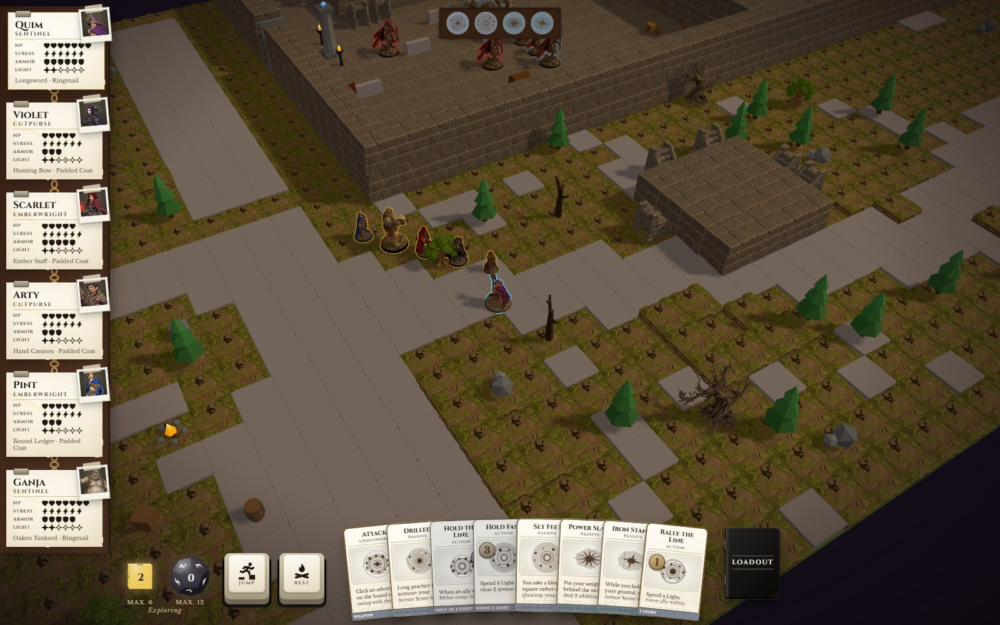
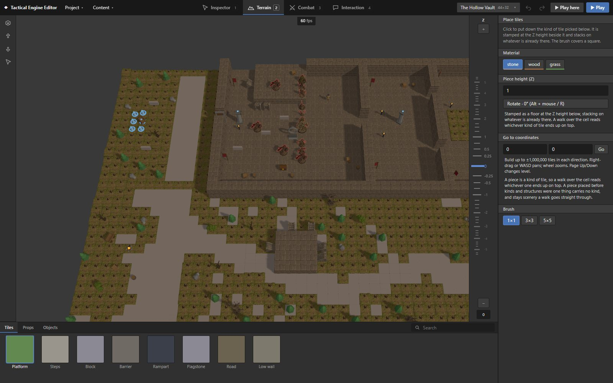

# Tactical Engine

A browser engine **and** editor for party-based tactical RPGs in the style of Baldur's Gate 3,
running a dual-dice tabletop ruleset: paired resolution dice, Light and Shadow, Stress, damage
thresholds, Armor Slots, domain cards, classes and subclasses, ancestries and communities,
adversaries, rests and levelling.

A project is a JSON document — scenes, objects, conversations, quests, items, loot tables — that
the engine executes directly. A designer builds a scenario in the editor and plays it without
writing any engine code.



## Run it

```bash
npm install
npm run dev        # http://127.0.0.1:8420
```

That opens the demo project: six characters, woods leading into a vault, and adversaries waiting
past the door. Click the board to walk, hold the button to steer, click a card to play it.
`docs/MANUAL.md` is the player's manual and covers the rest.

## Build a scenario

`Ctrl` + `E` switches between playing and editing, and **Play here** drops you into the game
standing where you were building.



Terrain and height, props and imported models, objects with locks and checks and prose,
adversaries and encounters, conversation graphs, quests, triggers and scripts — with undo,
validation, and a project that saves to a file you own. Content arrives and leaves as packs, so a
set of cards or creatures moves between projects without the engine being touched.

## How honest is that list

`docs/CRPG-GAPS.md` audits this repository against its own ambitions, and is kept deliberately
unflattering. Its summary today: *most of the way, for one room.* What is built is built end to
end and tested; what is missing is named there rather than implied away. Read it before believing
anything in this file.

## Developing

```bash
npx tsc --noEmit       # the only static check - no lint, no formatter
npx vitest run         # unit, around 2,300 tests
npx playwright test    # the browser suite, driven through window.__engine
```

The engine core is DOM-free and every module is tested. Randomness is seeded, so a fight replays
exactly. There is one schema for conditions and effects, and the runner executes anything a
document can hold.

| Read | For |
|---|---|
| `docs/CONTEXT.md` | The goal, the hard constraints, the stack. |
| `docs/DEVELOPING.md` | Extending the engine. §11 Gotchas repays reading twice. |
| `docs/BACKLOG.md` | What to build next, and the rules learned the expensive way. |
| `docs/CRPG-GAPS.md` | The audit above. |
| `docs/MANUAL.md` | Playing, for a player. |
| `AGENTS.md` | The same rules, written for a coding agent. |

## Licence

**AGPL-3.0-or-later.** `LICENSE` carries the text and `NOTICE.md` says what it covers. Section 13
is the one that matters here: a browser game is used over a network rather than handed over, so if
you run a modified copy and let other people play it, you owe those people the source of your
version.

Two things the licence does not reach, both set out in `NOTICE.md`. The play UI's font is Kreon,
used under the SIL Open Font License, which travels with it. And the rules this engine implements
are Public Game Content under the DPCGL: what is licensed here is the code that implements them,
never the rules themselves. The attribution that licence requires is kept in `docs/CONTEXT.md`.
Daggerheart is a trademark of Critical Role, LLC; this project is unaffiliated and unendorsed.
